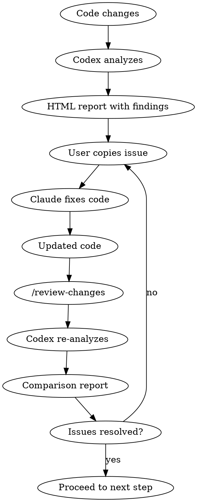

# Starterkit Design Document

**Date:** 2026-02-17
**Project:** Starterkit - Claude CLI Plugin for Small AI Development Teams
**Team Size:** 5 or fewer developers

**Credits:** Credit goes to [obra](https://github.com/obra/superpowers), [ComposioHQ](https://github.com/ComposioHQ/awesome-claude-skills), [Dammyjay93](https://github.com/Dammyjay93/interface-design), and [BehiSecc](https://github.com/BehiSecc/VibeSec-Skill) for their Claude Skills. Curated and customized by Jeff Lin, with some custom skills for small team collaboration. Includes core features such as AI session tracking, a `/publish` workflow, security audits, and optional visual-QA, real-time dashboards, design-system, and ai-agents modules.

## Executive Summary

Starterkit is a modular Claude CLI plugin system designed for small teams building AI-powered applications and AI agents. It addresses critical gaps in team collaboration for AI-assisted development: tracking AI prompt history alongside code, enforcing design system adherence, automating comprehensive pre-merge workflows, and providing visual QA tools.

**Installation:** Two commands
```bash
claude plugins install starterkit
starterkit init
```

## Problem Statement

Small AI development teams face unique challenges:

1. **Lost AI Context:** Git history shows code changes but not the AI prompts and iterations that produced them
2. **Inconsistent Quality:** Without structured workflows, AI-generated code bypasses team standards
3. **Design Drift:** Multiple developers using AI independently create inconsistent UX/UI
4. **Manual QA Burden:** Visual and functional testing requires manual coordination
5. **Security Blind Spots:** AI-specific vulnerabilities (prompt injection, data leakage) aren't caught by traditional tools
6. **Collaboration Conflicts:** Team members unknowingly overwrite each other's work

## Solution Overview

A modular plugin system with:

**Core Module** - Essential collaboration features installed by default
**Optional Modules** - Advanced capabilities teams enable as needed

### Core Features

1. **AI Session Tracking** - Captures prompts, sub-agent work, and outputs as browsable HTML reports committed alongside code
2. **`/publish` Workflow** - Orchestrates TDD → Codex review → security audit → visual QA → PR creation
3. **`/onboard` Skill** - Interactive setup for new team members
4. **`/security-audit` Skill** - Powered by VibeSec-Skill with AI-specific checks
5. **Curated Skills Bundle** - Best practices from superpowers, interface-design, and custom workflows

### Optional Modules

- **`@starterkit/visual-qa`** - Screenshot/video/audio comparison testing
- **`@starterkit/dashboard`** - Web UI for browsing sessions with GitHub/Notion sync
- **`@starterkit/design-system`** - Pre-commit enforcement + IDE integration
- **`@starterkit/ai-agents`** - LangChain/CrewAI patterns and templates

## Architecture

### Repository Structure

```
starterkit/
├── core/
│   ├── skills/                    # Curated + custom skills
│   │   ├── publish/
│   │   ├── onboard/
│   │   ├── security-audit/
│   │   ├── review-changes/
│   │   └── curated/              # Imported from superpowers, etc.
│   ├── ai-session-tracker/       # Background process
│   │   ├── tracker.js
│   │   ├── html-generator.js
│   │   └── git-integration.js
│   ├── hooks/                    # Git & Claude hooks
│   └── cli/                      # CLI commands
├── modules/
│   ├── visual-qa/
│   ├── dashboard/
│   ├── design-system/
│   └── ai-agents/
├── templates/                    # Project scaffolding
├── package.json
└── README.md
```

### Installation Flow

1. User runs: `claude plugins install starterkit`
2. Claude CLI downloads package from registry
3. User runs: `starterkit init` in project directory
4. Init script:
   - Creates `docs/ai-sessions/`, `docs/security/`, `docs/publish/` directories
   - Installs core skills to Claude's skill directory
   - Sets up git hooks (if git repo detected)
   - Starts AI session tracker background process
   - Generates `.starterkit/config.json` with defaults

### Module System

Modules register with core plugin:

```bash
starterkit add visual-qa
```

Module installation:
1. Downloads module package
2. Runs module's `install.sh` script
3. Registers module in `.starterkit/config.json`
4. Updates core workflows to include module hooks
5. Module skills become available immediately

## Core Components

### 1. AI Session Tracker

**Purpose:** Capture the full context of AI-assisted development - not just code changes, but the prompts and reasoning behind them.

**How It Works:**
- Runs as lightweight background process when Claude CLI is active
- Monitors file system for modifications
- Captures conversation context from Claude CLI session
- Detects Task tool usage and captures sub-agent hierarchy
- Writes structured HTML reports with copy-able sections

**Session File Structure:**
```
docs/ai-sessions/YYYY-MM-DD-HHmmss-<topic>.html
```

**HTML Report Contents:**
- Session metadata (timestamp, user, branch, files touched)
- Main prompt/goal
- Collapsible sub-agent tree (type, task, results)
- Code changes with syntax highlighting
- Copy buttons on every section
- "Ask Claude about this" pre-formatted prompts
- Links to related sessions

**Git Integration:**
- Auto-commits session HTML with code changes
- Commit message includes session ID
- Git history shows both code and AI reasoning

**Example Session Hierarchy:**
```
Main: "Add user authentication"
├── Sub-agent (Explore): "Find existing auth patterns"
│   └── Results: [files found, patterns identified]
├── Sub-agent (Plan): "Design auth flow"
│   └── Results: [plan document]
└── Code changes: [auth.ts, middleware.ts]
```

### 2. `/publish` Workflow

**Purpose:** Comprehensive pre-merge validation ensuring quality, security, and team standards.

**Workflow Steps:**

```
1. Test-Driven Development Check
   └─> Runs test suite, validates coverage

2. Code Review (Codex ↔ Claude Loop)
   └─> Codex analyzes code
   └─> User copies findings to Claude
   └─> Claude fixes issues
   └─> Re-review until clean

3. Security Audit
   └─> Runs VibeSec-Skill + custom AI checks
   └─> Generates security report

4. Visual QA
   └─> Manual checklist (core)
   └─> Automated comparison (if visual-qa module installed)

5. PR Creation
   └─> All reports committed to branch
   └─> PR description links to reports
   └─> Team can review full audit trail
```

**Reports Generated:**
- `docs/publish/YYYY-MM-DD-HHmmss-<branch>.html` - Master report linking all checks
- `docs/code-review/YYYY-MM-DD-HHmmss-review.html` - Codex findings + resolutions
- `docs/security/YYYY-MM-DD-HHmmss-audit.html` - Security scan results
- `docs/visual-qa/YYYY-MM-DD-HHmmss-comparison.html` - Visual diffs (if module installed)

**Failure Handling:**
- Failed checks highlighted in red
- Copy-able error details for pasting to Claude
- User can skip specific checks: `starterkit publish --skip-visual-qa`
- Partial reports saved, PR not created until all pass

### 3. Codex ↔ Claude Review Loop

**Purpose:** Iterative code quality improvement combining Codex's analysis with Claude's implementation skills.

**Flow:**



**Review Report Features:**
- Finding categories: style, bugs, performance, security, improvements
- Severity levels with visual indicators
- Code snippets with line numbers and copy buttons
- Claude fix suggestions
- Before/after comparison showing resolution
- Finding IDs for traceability (e.g., `CODEX-023`)

**Skills:**
- `/publish` - Triggers initial review
- `/review-changes` - Re-analyzes after fixes
- Reports track full conversation history

### 4. `/security-audit` Skill

**Purpose:** Comprehensive security scanning with focus on AI-specific vulnerabilities.

**Components:**

**VibeSec-Skill Integration:**
- Primary security engine (imported from BehiSecc/VibeSec-Skill)
- General security best practices
- Vulnerability detection

**AI-Specific Checks:**
- Prompt injection vulnerabilities
- PII/sensitive data in training data or prompts
- API key exposure in code or AI session logs
- Model access control validation
- Data leakage through model outputs
- Unsafe deserialization of AI responses

**Output:**
```
docs/security/YYYY-MM-DD-HHmmss-audit.html
```

**Report Sections:**
- Executive summary with severity counts
- VibeSec findings
- AI-specific findings
- Code snippets with vulnerabilities highlighted
- Remediation suggestions (copy-able for Claude)
- Compliance checklist (OWASP, AI-specific standards)

### 5. `/onboard` Skill

**Purpose:** Streamline new team member setup and introduce team workflows.

**Interactive Checklist:**
1. Environment setup (Node, Claude CLI, git config)
2. Clone repositories and install starterkit
3. Tour of core skills and when to use them
4. Design system introduction (if module installed)
5. First practice task with AI session tracking
6. Review example session reports and workflows

**Output:**
- Personalized onboarding session in `docs/ai-sessions/`
- Completion checklist for manager review
- Quick reference guide generated

### 6. Curated Skills Bundle

**From superpowers:**
- `brainstorming` - Turn ideas into designs
- `test-driven-development` - TDD workflow
- `systematic-debugging` - `/debug` for troubleshooting
- `writing-plans` - Implementation planning
- `requesting-code-review` - Pre-merge reviews
- `receiving-code-review` - Handle feedback

**From interface-design:**
- Design system patterns
- Component guidelines
- UX best practices

**Custom Skills:**
- `/publish` - Full pre-merge workflow
- `/onboard` - Team member setup
- `/security-audit` - Security scanning
- `/review-changes` - Codex re-analysis

## Data Flow

### AI Session Capture

```
1. Claude CLI session starts
2. Background tracker activates
3. User prompts Claude → tracker captures
4. Files modified → tracker records changes
5. Task tool spawns sub-agent → tracker captures hierarchy
6. Session ends → HTML report generated
7. Report auto-committed to git with code
```

### Publish Workflow

```
1. User: starterkit publish
2. Run TDD checks → generate test report
3. Send code to Codex → review report
4. User copies findings → iterates with Claude
5. User: starterkit review-changes → validation report
6. Run security audit → security report
7. Run visual QA (manual or automated) → QA report
8. All reports committed to branch
9. Create PR with report links in description
10. Team reviews PR + embedded reports on GitHub
```

### Module Integration

```
1. User: starterkit add visual-qa
2. Module downloaded and installed
3. Module registers with core config
4. Core's /publish detects module
5. /publish adds visual-qa steps automatically
6. visual-qa generates reports in docs/visual-qa/
7. Master publish report links to visual-qa results
```

## Optional Modules

### @starterkit/visual-qa

**Capabilities:**
- Screenshot comparison (Playwright + Percy or Chromatic)
- Video/animation comparison (FFmpeg frame-by-frame analysis)
- Audio comparison (waveform + spectral diff for SFX/music)

**Installation:**
```bash
starterkit add visual-qa
```

**Configuration:**
```json
{
  "visual-qa": {
    "baselinePath": "tests/visual-baselines/",
    "diffThreshold": 0.05,
    "routes": ["/", "/dashboard", "/profile"],
    "videoTests": ["animations/hero-transition.spec.ts"],
    "audioTests": ["sfx/button-click.wav", "music/theme.mp3"]
  }
}
```

**Integration with /publish:**
- Replaces manual visual testing step
- Automatically captures screenshots of defined routes
- Compares against baselines
- Generates interactive HTML with:
  - Side-by-side comparisons
  - Slider for before/after overlay
  - Video playback controls with frame stepping
  - Audio waveform visualization
  - Diff highlighting

**Output:**
```
docs/visual-qa/YYYY-MM-DD-HHmmss-comparison.html
```

### @starterkit/dashboard

**Purpose:** Centralized browsing of team's AI activity and session history.

**Features:**
- Local web UI (Express + React)
- Search/filter sessions by developer, date, files, agent types
- Timeline view of team activity
- Session detail viewer (embedded HTML reports)
- GitHub Issues integration (each session → labeled issue)
- Notion database integration (sessions as database entries)

**Installation:**
```bash
starterkit add dashboard
starterkit dashboard
# Opens at localhost:3000
```

**Views:**
- **Timeline:** Visual timeline of all AI sessions across team
- **Search:** Full-text search through prompts and outputs
- **Developer:** Filter by team member
- **Files:** See all sessions that touched specific files
- **Reports:** Browse security audits, code reviews, publish workflows

**Sync Options:**
- **GitHub:** Sessions synced as Issues with `starterkit-session` label
- **Notion:** Sessions as database entries with properties (date, developer, files)
- **Local-only:** No external sync, just local web UI

### @starterkit/design-system

**Purpose:** Enforce design consistency across AI-generated code.

**Based on:** Dammyjay93's interface-design patterns

**Capabilities:**

**Pre-commit Hooks:**
- Scans staged files for hardcoded colors, spacing, typography
- Blocks commits with violations
- Generates violation report with suggested fixes

**IDE Integration:**
- VS Code extension suggests design-system-compliant code
- Auto-complete for design tokens
- Inline warnings for violations

**Token System:**
```typescript
// Generated from starterkit design-system init
export const tokens = {
  colors: { primary: '#...', secondary: '#...' },
  spacing: { xs: '4px', sm: '8px', md: '16px', ... },
  typography: { heading: '...', body: '...' }
}
```

**Installation:**
```bash
starterkit add design-system
starterkit design-system init
# Generates tokens file, sets up hooks
```

**Integration with /publish:**
- Design compliance check added to workflow
- Report shows violations with severity
- Links to design system documentation

**Customization:**
- Team defines tokens in `design-system.config.js`
- Custom rules for component usage
- Exemptions for specific files/patterns

### @starterkit/ai-agents

**Purpose:** Patterns and tools for building AI agents with LangChain, CrewAI, LangGraph.

**Includes:**

**Architecture Templates:**
- ReAct (Reasoning + Acting)
- Plan-and-Execute
- Reflexion (self-correction)
- Multi-agent collaboration patterns

**Skills:**
- `/agent-scaffold` - Generate agent boilerplate from pattern
- `/trace-agent` - Debug agent decision paths
- `/test-agent` - Specialized testing for agent behaviors

**Testing Utilities:**
- Mock LLM responses for deterministic tests
- Agent behavior assertions
- Decision path validation
- Tool usage verification

**Debugging Tools:**
- Visual trace of agent reasoning
- Step-through agent execution
- Prompt/response logging

**Installation:**
```bash
starterkit add ai-agents
```

**Example Usage:**
```bash
starterkit agent-scaffold --pattern=react --name=ResearchAgent
# Generates scaffolded agent with tests and tracing
```

## Error Handling

### AI Session Tracker Failures

**Scenario:** Cannot write to docs/ai-sessions/

**Response:**
- Log error to `.starterkit/errors.log`
- Show CLI warning: "Session tracking paused - check .starterkit/errors.log"
- Continue running without blocking work
- Provide manual save: `starterkit save-session "description"`

**Scenario:** Claude CLI crashes mid-session

**Response:**
- Save partial session with `[incomplete]` marker
- Include captured context up to crash point
- User can resume or ignore

### Publish Workflow Failures

**Scenario:** Test step fails

**Response:**
- Generate report with failures highlighted in red
- Show copy-able error details
- Suggest fixes based on error patterns
- User copies errors → pastes to Claude → fixes → reruns

**Scenario:** User wants to skip a check

**Response:**
- Allow: `starterkit publish --skip-security-audit`
- Note skip in PR description with warning icon
- Require explicit flag (no silent skips)

### Module Installation Failures

**Scenario:** Missing dependencies

**Response:**
- Clear error: "visual-qa requires ffmpeg"
- Show install command: `brew install ffmpeg`
- Verify after install before proceeding

**Scenario:** Module conflicts with existing setup

**Response:**
- Show diff of conflicting configurations
- Ask for confirmation before overwriting
- Provide rollback: `starterkit remove visual-qa`

### Git/GitHub Integration Failures

**Scenario:** Cannot commit reports (merge conflicts)

**Response:**
- Save reports to `.starterkit/pending-reports/`
- Warn user: "Reports saved locally - commit manually after resolving conflicts"
- Provide merge helper: `starterkit commit-reports`

**Scenario:** PR creation fails (no GitHub CLI, auth issues)

**Response:**
- Show manual `gh pr create` command with all correct flags
- Save PR description to `.starterkit/pr-description.md`
- User can create PR manually with saved content

### General Principles

- **Never block work:** Fail gracefully, provide workarounds
- **Actionable errors:** Always show next steps
- **Copy-able details:** Error messages ready for pasting to Claude
- **Doctor command:** `starterkit doctor` diagnoses issues

## Testing Strategy

### Skill Testing

**Manual Testing:**
```bash
starterkit test-skill publish
# Runs skill with sample inputs, verifies outputs
```

**Validation:**
- Skill produces expected files in correct locations
- Workflow steps execute in correct order
- Error handling triggers appropriately
- Reports are well-formed HTML

**Self-Check:**
- Each skill includes validation command
- Checks for required sections, proper formatting
- Verifies integration points with core

### AI Session Tracker Testing

**Integration Tests:**
- Mock Claude CLI session + file modifications
- Verify HTML output structure and copy buttons
- Test sub-agent capture (nested Task tool calls)
- Validate git auto-commit functionality

**Crash Handling:**
- Simulate interruptions mid-session
- Verify partial session saves with markers
- Test recovery on next session start

### Module Testing

**visual-qa:**
- Test with known before/after screenshots
- Verify diff detection at various thresholds
- Validate video frame comparison
- Check audio waveform analysis

**dashboard:**
- Mock GitHub/Notion APIs
- Test session sync and retrieval
- Verify search/filter functionality
- Check timeline rendering

**design-system:**
- Test pre-commit hooks with violating code
- Verify IDE integration suggestions
- Validate token generation

**ai-agents:**
- Test scaffold generation for each pattern
- Verify tracing output for sample agents
- Validate testing utilities with mock agents

### End-to-End Testing

**Full /publish Workflow:**
- Sample project with deliberate issues
- Verify each step: TDD → Codex → security → visual QA → PR
- Test failure handling at each step
- Validate all reports generated and committed

**Multi-developer Simulation:**
- Multiple team members run workflows simultaneously
- Verify timestamp uniqueness prevents conflicts
- Test concurrent dashboard access

### Systematic Debugging Integration

**Use `/debug` skill for:**
- Troubleshooting test failures
- Investigating tracker issues
- Diagnosing module integration problems
- CI/CD workflow failures

**Documentation:**
- Include `/debug` in error messages
- Link to debugging guides in reports
- Provide debug examples for common issues

### CI/CD

**Dogfooding:**
- Starterkit repo uses its own `/publish` workflow
- GitHub Actions run full test suite on every PR
- Visual regression tests on sample projects
- Security audits on starterkit code itself

### Team Validation

**Demo Project:**
```bash
starterkit init-demo
# Creates sample app with deliberate issues for testing
```

**Doctor Command:**
```bash
starterkit doctor
# Checks: Claude CLI installed, git configured, modules healthy
# Suggests fixes for any issues found
# Recommends using /debug for complex problems
```

## Tech Stack

### Core
- **Language:** TypeScript/Node.js
- **CLI Framework:** Commander.js or oclif
- **HTML Generation:** Template literals or Handlebars
- **Git Integration:** simple-git library
- **Process Management:** pm2 or custom daemon

### Modules
- **visual-qa:** Playwright, Percy/Chromatic, FFmpeg
- **dashboard:** Express, React, Tailwind CSS
- **design-system:** ESLint plugin architecture, VS Code extension API
- **ai-agents:** LangChain SDK, LangGraph

### Distribution
- **Package Manager:** npm
- **Claude CLI Plugin API:** Official plugin system
- **Module Registry:** npm scoped packages (`@starterkit/*`)

## Success Metrics

**Core Adoption:**
- Installation completion rate (init without errors)
- Session tracking activity (sessions captured per week)
- `/publish` usage (PRs created via workflow)

**Quality Improvements:**
- Reduced PR revision cycles (before/after Codex loop)
- Security audit findings caught pre-merge
- Design system compliance scores

**Team Collaboration:**
- AI session reference in PR discussions
- Dashboard usage (if module installed)
- Onboarding time for new team members

**Module Adoption:**
- Which modules are most/least used
- Module-specific metrics (e.g., visual-qa pass rates)

## Future Enhancements

**Potential Additions:**
- Slack/Discord integration for notifications
- Performance monitoring module (Core Web Vitals, LCP, etc.)
- Cost tracking for AI usage (API calls, tokens)
- Team analytics dashboard (productivity insights)
- Mobile app for reviewing sessions on-the-go
- Integration with more design tools (Figma API)

## Open Questions for Implementation

1. **Session Tracker Implementation:** Background daemon vs. Claude CLI hook?
2. **Codex Integration:** API key management, rate limits, cost per review?
3. **Module Installation:** npm vs. custom registry vs. git submodules?
4. **HTML Report Styling:** Minimal CSS vs. framework (Tailwind)?
5. **GitHub/Notion Sync:** Real-time vs. batch (scheduled)?

These will be resolved during implementation planning phase.

## Appendix: Example Workflows

### Scenario 1: New Feature Development

```bash
# Developer starts work
git checkout -b feature/user-auth

# Claude helps implement
# AI session tracker captures all prompts + sub-agents
# Session saved: docs/ai-sessions/2026-02-17-143022-user-auth.html

# Ready to merge
starterkit publish

# Workflow runs:
# 1. Tests pass ✓
# 2. Codex review finds 3 issues
# 3. Developer copies issues to Claude
# 4. Claude fixes, developer runs: starterkit review-changes
# 5. Codex validates fixes ✓
# 6. Security audit finds no issues ✓
# 7. Visual QA checklist completed ✓
# 8. PR created with links to all reports

# Team reviews PR, sees full audit trail in GitHub
```

### Scenario 2: Debugging with Session History

```bash
# Bug reported: login breaks on mobile

# Developer searches sessions
starterkit dashboard
# Searches for "login" in web UI
# Finds session from 3 days ago where auth flow was modified
# Reviews prompts and Claude's reasoning
# Copies relevant session section

# Pastes to Claude with bug description
# Claude reviews its previous work, identifies issue
# New session tracks the fix
# /publish workflow validates fix
```

### Scenario 3: Onboarding New Team Member

```bash
# New developer joins
starterkit onboard

# Interactive checklist:
# ✓ Install Claude CLI
# ✓ Clone repos
# ✓ Install starterkit
# ✓ Review example sessions
# ✓ Complete practice task (create component)
# ✓ Run /publish workflow
# ✓ Review generated reports

# Onboarding session saved for manager review
# New developer ready to contribute
```

---

## Conclusion

Starterkit transforms AI-assisted development from individual productivity tool to structured team workflow. By capturing AI reasoning, enforcing quality gates, and providing visual validation, it enables small teams to move fast without sacrificing quality or collaboration.

**Next Steps:** Implementation planning via `/writing-plans` skill.
